<pre>
 ▄█        ▄██████▄   ▄█     █▄   ▄█  ███▄▄▄▄      ▄██████▄  ▀████    ▐████▀
███       ███    ███ ███     ███ ███  ███▀▀▀██▄   ███    ███   ███▌   ████▀ 
███       ███    ███ ███     ███ ███▌ ███   ███   ███    █▀     ███  ▐███   
███       ███    ███ ███     ███ ███▌ ███   ███  ▄███           ▀███▄███▀   
███       ███    ███ ███     ███ ███▌ ███   ███ ▀▀███ ████▄     ████▀██▄    
███       ███    ███ ███     ███ ███  ███   ███   ███    ███   ▐███  ▀███   
███▌    ▄ ███    ███ ███ ▄█▄ ███ ███  ███   ███   ███    ███  ▄███     ███▄ 
█████▄▄██  ▀██████▀   ▀███▀███▀  █▀    ▀█   █▀    ████████▀  ████       ███▄
</pre>

<samp>
<b>OS:</b> MX Linux | <b>Terminal:</b> Kitty + Zellij | <b>Shell:</b> Zsh
</samp>

---

### Environment & Stack

**Scripting & Web**
> JavaScript, React, Node.js, HTML5, CSS3, Vite, Tailwind

**Python & Automation**
> Flask, SQLAlchemy, Selenium, Pytest, JWT, PostgreSQL, Redis

**Security Research**
> Burp Suite (Manual), MITRE ATT&CK, OWASP Top 10, Wireshark

**Workflow**
> ACME Editor, Neovim, Docker, Git, GitHub Actions

---

### Metrics

  

---

Rest at Bonfire

   
  
   
  <samp>Manual exploitation mindset. ACME user.</samp>

