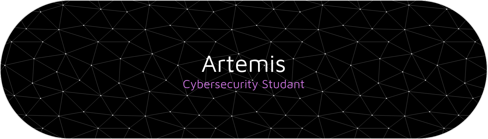

  

  <samp>
    <h3>🕵️ System Information</h3>
    <b>OS:</b> MX Linux | <b>Terminal:</b> Zellij + Alacritty | <b>Shell:</b> Zsh
  </samp>

---

### 🛠️ Tech Stack & Workflow

#### 💻 Languages & Low Level

  
  
  
  
  

#### 🔐 Cybersecurity & Frameworks

  
  
  

#### ⚡ IDEs & Tools

  
  
  
  

---

### 📊 GitHub Stats (Gruvbox Edition)

  
  

<b>☕ Coffee Break (Rest at Bonfire)</b>

  
   
  <samp>Checkpoint reached. All progress saved.</samp>

  

