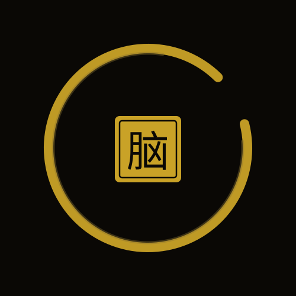
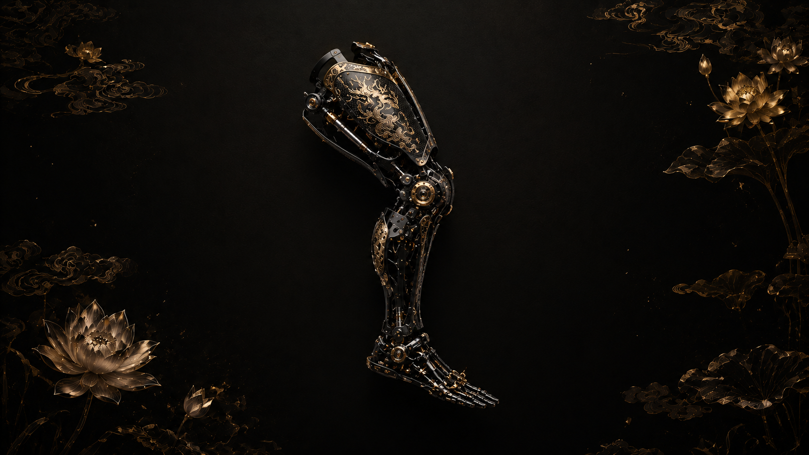

<p align="center">



<br/>

# Lowingx

### 神经工程 · Estudante de Engenharia Neural

### Neural engineering student · Rust embedded · BCI · Shenzhen-bound

[](https://github.com/Lowingx)
[](discord://discord.com/users/oni.huli_jung)
<!--[](https://www.linkedin.com/in/gustavo-almeida-ti/)-->
</p>

## 愛 · Sobre Mim



Estudante do último ano do ensino médio no Brasil. Aprendendo programação, eletrônica e mandarim enquanto construo o caminho para a China.

Onde estou agora: Brasil — portfólio, HSK3, eletrônica.
Onde vou estar: SUSTech, Shenzhen — Engenharia Biomédica (2027).

<br clear="right"/>

## 愛 · O Que Estou Fazendo

> *為學日益，為道日損* — estudar: somar a cada dia; o caminho: subtrair

| Área | Status |
|------|--------|
| C++ / Wayland | ✅ [focusZ](https://github.com/Lowingx/hypr-focuZ) — plugin Hyprland com CI e demo |
| Blue Team / SOC | ✅ [honeypot](https://github.com/Lowingx/HoneyPot) · [log-analyzer](https://github.com/Lowingx/LogAnalyzer) · [nexusrecon](https://github.com/Lowingx/NexusRecon) |
| Rust embarcado | 🔨 [p02-rust-firmware](https://github.com/Lowingx/P02-Rust-Firmware) — `no_std` no ESP32 |
| Eletrônica | ✅ [p01](https://github.com/Lowingx/P01-LED-Botao) → P02 → sinais |
| EEG / sinais neurais | 📚 estudando |
| Mandarim | 📚 HSK3 |

## 愛 · Stack

<p align="center">


</p>

## 愛 · 普通话

> *千里之行，始于足下*

| Nível | Status |
|-------|--------|
| HSK 1 | ✅ |
| HSK 2 | 📚 |
| HSK 3 | 🎯 dez/2026 |
| HSK 4 | 🎯 fev/2027 |

## 愛 · Mapa

```
2026 ─── fundamentos · portfólio · documentos
2027 ─── Shenzhen → SUSTech (ano preparatório)
2028 ─── BME · laboratório
20xx ─── cyberware
```

## 愛 · exo-power-suit



**[exo-power-suit](https://github.com/Lowingx/exo-power-suit)** é um exoesqueleto de perna com controle por EMG que reage mais rápido que o corpo humano. Visão de longo prazo — nasce na fase Shenzhen.

> *Construir pontes entre cérebro e máquina, uma perna de cada vez.*

**[GitHub](https://github.com/Lowingx/exo-power-suit)** · **[Documentação](https://github.com/Lowingx/exo-power-suit#readme)**

- EMG MyoWare 2.0 para detecção de intenção muscular
- Predição 50ms antes do movimento
- Safety MCU independente para emergências
- Firmware em Rust para tempo real

<p align="center">

**愛**

</p>
